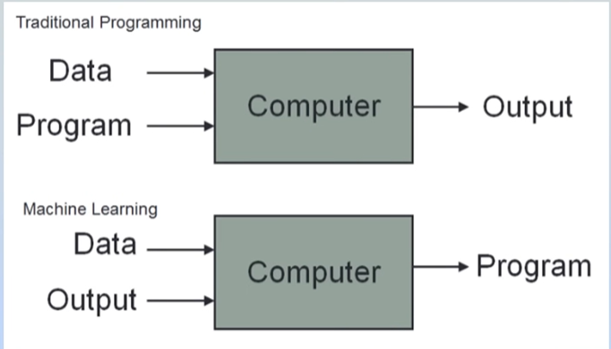

# Machine Learning

Machine learning is a field of computer science that uses statistical techniques to give computer systems the ability to "learn" with data, without being explicitly programmed.

It powers many technologies we use every day, from 
recommendation systems and search engines to voice 
assistants and self-driving cars. Machine learning
is also used in spam detection, fraud prevention, 
medical diagnosis, image and speech recognition, 
language translation, personalized advertising, 
financial forecasting, cybersecurity, and social 
media content recommendations. As the amount of 
data generated worldwide continues to grow, 
machine learning plays an increasingly important 
role in helping computers analyze information, 
automate tasks, and make intelligent decisions.