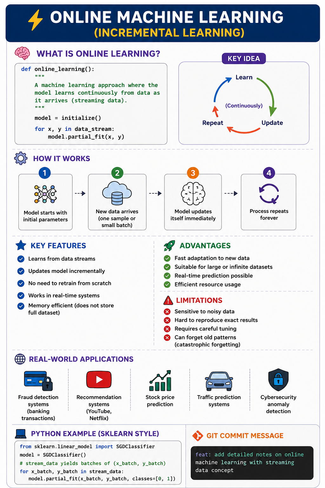

# ⚡ Online Machine Learning (Incremental Learning)

---

## 🧠 What is Online Learning?

def online_learning():
    """
    A machine learning approach where the model learns
    continuously from data as it arrives (streaming data).
    """
    model = initialize()

    for x, y in data_stream:
        model.partial_fit(x, y)

# 👉 Key Idea:
- Learn → Update → Repeat (continuously)

---

## 🔄 How It Works

1. Model starts with initial parameters
2. New data arrives (one sample or small batch)
3. Model updates itself immediately
4. Process repeats forever

---

## ⚡ Key Features

- Learns from **data streams**
- Updates model **incrementally**
- No need to retrain from scratch
- Works in **real-time systems**
- Memory efficient (does not store full dataset)

---

## 🚀 Advantages

- Fast adaptation to new data
- Suitable for large or infinite datasets
- Real-time prediction possible
- Efficient resource usage

---

## ❌ Limitations

- Sensitive to noisy data
- Hard to reproduce exact results
- Requires careful tuning
- Can forget old patterns (catastrophic forgetting)

---

## 🌍 Real-World Applications

- 💳 Fraud detection systems (banking transactions)
- 🎥 Recommendation systems (YouTube, Netflix)
- 📈 Stock price prediction
- 🚗 Traffic prediction systems
- 🛡️ Cybersecurity anomaly detection

---

## 🧪 Python Example (sklearn style)

from sklearn.linear_model import SGDClassifier

model = SGDClassifier()

for x_batch, y_batch in stream_data:
    model.partial_fit(x_batch, y_batch, classes=[0, 1])

---

## 🧾 Git Commit Message

feat: add detailed notes on online machine learning with streaming data concept