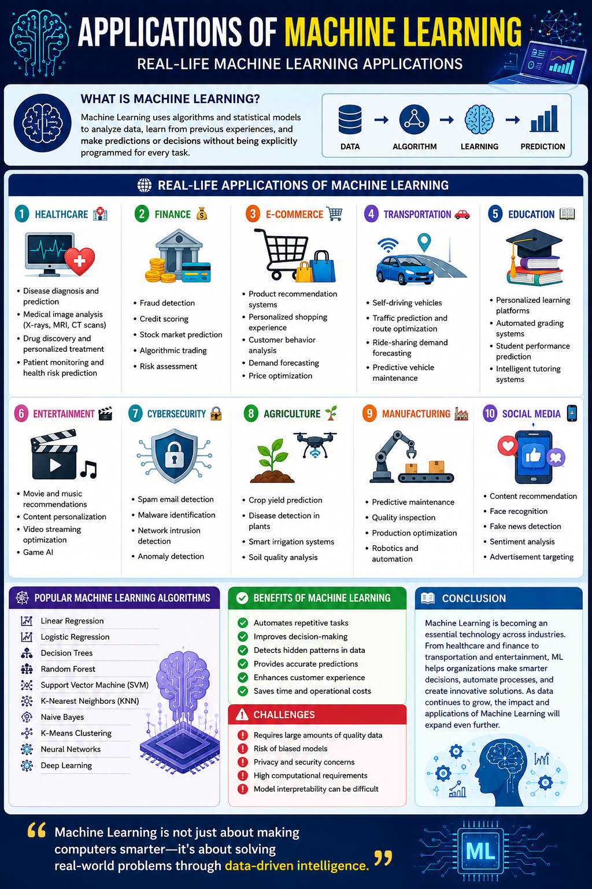

# 🤖 Applications of Machine Learning | Real-Life Machine Learning Applications

Machine Learning (ML) is a branch of Artificial Intelligence (AI) that enables computers to learn from data, identify patterns, and make decisions with minimal human intervention. It is transforming industries by improving efficiency, accuracy, and automation.

## 📌 What is Machine Learning?

Machine Learning uses algorithms and statistical models to analyze data, learn from previous experiences, and make predictions or decisions without being explicitly programmed for every task.

---

## 🌍 Real-Life Applications of Machine Learning

### 1. Healthcare 🏥

* Disease diagnosis and prediction
* Medical image analysis (X-rays, MRI, CT scans)
* Drug discovery and personalized treatment
* Patient monitoring and health risk prediction

### 2. Finance 💰

* Fraud detection
* Credit scoring
* Stock market prediction
* Algorithmic trading
* Risk assessment

### 3. E-Commerce 🛒

* Product recommendation systems
* Personalized shopping experience
* Customer behavior analysis
* Demand forecasting
* Price optimization

### 4. Transportation 🚗

* Self-driving vehicles
* Traffic prediction and route optimization
* Ride-sharing demand forecasting
* Predictive vehicle maintenance

### 5. Education 📚

* Personalized learning platforms
* Automated grading systems
* Student performance prediction
* Intelligent tutoring systems

### 6. Entertainment 🎬

* Movie and music recommendations
* Content personalization
* Video streaming optimization
* Game AI

### 7. Cybersecurity 🔒

* Spam email detection
* Malware identification
* Network intrusion detection
* Anomaly detection

### 8. Agriculture 🌱

* Crop yield prediction
* Disease detection in plants
* Smart irrigation systems
* Soil quality analysis

### 9. Manufacturing 🏭

* Predictive maintenance
* Quality inspection
* Production optimization
* Robotics and automation

### 10. Social Media 📱

* Content recommendation
* Face recognition
* Fake news detection
* Sentiment analysis
* Advertisement targeting

---

## 🚀 Popular Machine Learning Algorithms

* Linear Regression
* Logistic Regression
* Decision Trees
* Random Forest
* Support Vector Machine (SVM)
* K-Nearest Neighbors (KNN)
* Naive Bayes
* K-Means Clustering
* Neural Networks
* Deep Learning

---

## 🎯 Benefits of Machine Learning

* Automates repetitive tasks
* Improves decision-making
* Detects hidden patterns in data
* Provides accurate predictions
* Enhances customer experience
* Saves time and operational costs

---

## ⚠️ Challenges

* Requires large amounts of quality data
* Risk of biased models
* Privacy and security concerns
* High computational requirements
* Model interpretability can be difficult

---

## 📖 Conclusion

Machine Learning is becoming an essential technology across industries. From healthcare and finance to transportation and entertainment, ML helps organizations make smarter decisions, automate processes, and create innovative solutions. As data continues to grow, the impact and applications of Machine Learning will expand even further.

**"Machine Learning is not just about making computers smarter—it's about solving real-world problems through data-driven intelligence."**

