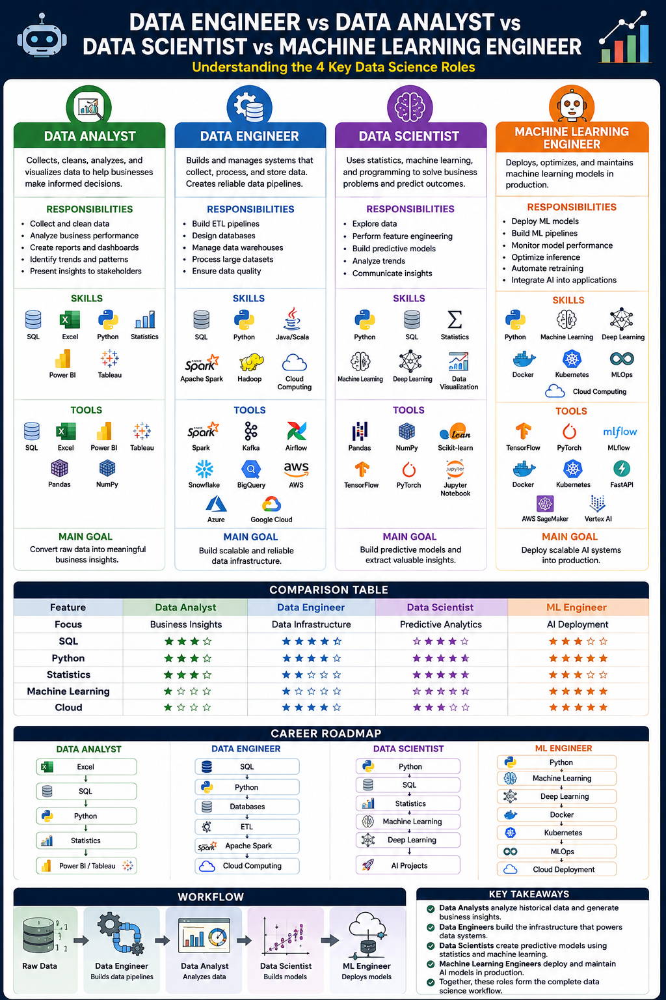

# 🤖 Data Engineer vs Data Analyst vs Data Scientist vs Machine Learning Engineer

## 📌 Introduction

Data Science consists of several specialized roles, each responsible for different stages of the data lifecycle. While they all work with data, their responsibilities, required skills, and end goals differ.

The four major roles are:

- 📊 Data Analyst
- 🏗️ Data Engineer
- 🧠 Data Scientist
- 🤖 Machine Learning Engineer

---

# 📊 Data Analyst

## Who is a Data Analyst?

A Data Analyst collects, cleans, analyzes, and visualizes data to help businesses make informed decisions.

### Responsibilities

- Collect and clean data
- Analyze business performance
- Create reports and dashboards
- Identify trends and patterns
- Present insights to stakeholders

### Skills

- SQL
- Excel
- Python
- Statistics
- Power BI
- Tableau

### Tools

- SQL
- Excel
- Power BI
- Tableau
- Pandas
- NumPy

### Main Goal

Convert raw data into meaningful business insights.

---

# 🏗️ Data Engineer

## Who is a Data Engineer?

A Data Engineer builds and manages the systems that collect, process, and store data. They create reliable data pipelines for analysts and data scientists.

### Responsibilities

- Build ETL pipelines
- Design databases
- Manage data warehouses
- Process large datasets
- Ensure data quality

### Skills

- SQL
- Python
- Java/Scala
- Apache Spark
- Hadoop
- Cloud Computing

### Tools

- Apache Spark
- Kafka
- Airflow
- Snowflake
- BigQuery
- AWS
- Azure
- Google Cloud

### Main Goal

Build scalable and reliable data infrastructure.

---

# 🧠 Data Scientist

## Who is a Data Scientist?

A Data Scientist uses statistics, machine learning, and programming to solve business problems and predict future outcomes.

### Responsibilities

- Explore data
- Perform feature engineering
- Build predictive models
- Analyze trends
- Communicate insights

### Skills

- Python
- SQL
- Statistics
- Machine Learning
- Deep Learning
- Data Visualization

### Tools

- Pandas
- NumPy
- Scikit-learn
- TensorFlow
- PyTorch
- Jupyter Notebook

### Main Goal

Build predictive models and extract valuable insights.

---

# 🤖 Machine Learning Engineer

## Who is a Machine Learning Engineer?

A Machine Learning Engineer deploys, optimizes, and maintains machine learning models in production.

### Responsibilities

- Deploy ML models
- Build ML pipelines
- Monitor model performance
- Optimize inference
- Automate retraining
- Integrate AI into applications

### Skills

- Python
- Machine Learning
- Deep Learning
- Docker
- Kubernetes
- MLOps
- Cloud Computing

### Tools

- TensorFlow
- PyTorch
- MLflow
- Docker
- Kubernetes
- FastAPI
- AWS SageMaker
- Vertex AI

### Main Goal

Deploy scalable AI systems into production.

---

# 📊 Comparison Table

| Feature | Data Analyst | Data Engineer | Data Scientist | ML Engineer |
|----------|--------------|---------------|----------------|-------------|
| Focus | Business Insights | Data Infrastructure | Predictive Analytics | AI Deployment |
| SQL | ⭐⭐⭐⭐ | ⭐⭐⭐⭐⭐ | ⭐⭐⭐⭐ | ⭐⭐⭐ |
| Python | ⭐⭐⭐ | ⭐⭐⭐⭐ | ⭐⭐⭐⭐⭐ | ⭐⭐⭐⭐⭐ |
| Statistics | ⭐⭐⭐⭐ | ⭐⭐ | ⭐⭐⭐⭐⭐ | ⭐⭐⭐ |
| Machine Learning | ⭐ | ⭐ | ⭐⭐⭐⭐⭐ | ⭐⭐⭐⭐⭐ |
| Cloud | ⭐ | ⭐⭐⭐⭐ | ⭐⭐⭐ | ⭐⭐⭐⭐⭐ |

---

# 🛣️ Career Roadmap

## Data Analyst

Excel
→ SQL
→ Python
→ Statistics
→ Power BI / Tableau

## Data Engineer

SQL
→ Python
→ Databases
→ ETL
→ Apache Spark
→ Cloud Computing

## Data Scientist

Python
→ SQL
→ Statistics
→ Machine Learning
→ Deep Learning
→ AI Projects

## Machine Learning Engineer

Python
→ Machine Learning
→ Deep Learning
→ Docker
→ Kubernetes
→ MLOps
→ Cloud Deployment

---

# 🔄 Workflow

Raw Data
↓
Data Engineer
↓
Data Analyst
↓
Data Scientist
↓
Machine Learning Engineer

---

# 🎯 Key Takeaways

- **Data Analysts** analyze historical data and generate business insights.
- **Data Engineers** build the infrastructure that powers data systems.
- **Data Scientists** create predictive models using statistics and machine learning.
- **Machine Learning Engineers** deploy and maintain AI models in production.
- Together, these roles form the complete data science workflow.